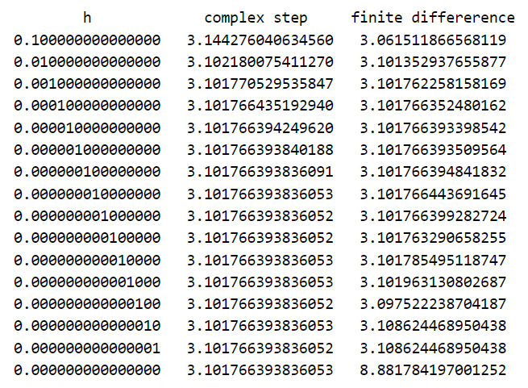
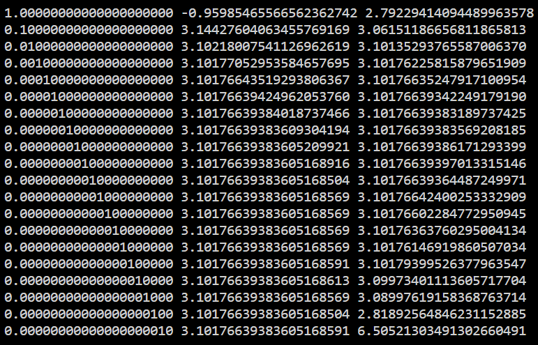

# Complex-step Differentiation

## Motivation

Simple method for approximating derivative of $f(x)$:
$$
f'(x) \approx \frac{f(x + h) - f(x)}{h}
$$
for some small $h$.

Main disadvantage: you have to evaluate $f$ twice and take a difference, which could lead to loss in significant digits with a computer (catastrophic cancellation).

Example:
$$
h = 10^{-9} \\
f(x + h) \approx 0.123456789123456789 \\
f(x) \approx 0.123456789000000000 \\
\frac{f(x + h) - f(x)}{h} \approx 0.123456789
$$
But computers can't hold infinitely many decimal places, so they might do something like this:
$$
h = 10^{-9} \\
f(x + h) \approx 0.123456789123456789 \text{ which rounds to } 0.123456789 \\
f(x) \approx 0.123456789000000000 \text{ which rounds to } 0.123456789 \\
\frac{f(x + h) - f(x)}{h} = 0
$$

## The Method

Prerequisite: $f(z)$ is a **complex analytic function** (sometimes also called holomorphic), meaning it is "at every point of its domain, complex differentiable in a neighborhood of the point."

Consider some complex number $x_0 + ih$, where $h$ is once again small. Consider the Taylor series expansion of $f(z)$ at $x_0 + ih$:
$$
f(x_0 + ih) = f(x_0) + ih \cdot f'(x_0) - h^2 \cdot f''(x_0) / 2! - ih^3 \cdot f^{(3)}(x_0)/3! + \dots
$$
Take the imaginary part of both sides, divide by $h$, omit the trailing terms of the Taylor series expansion since it's an approximation:
$$
\Im (f(x_0 + ih)) \approx h \cdot f'(x_0) \\
f'(x_0) \approx \frac{\Im (f(x_0 + ih))}{h}
$$

## Benchmarking

One of the [articles](https://blogs.mathworks.com/cleve/2013/10/14/complex-step-differentiation/) I referenced does a benchmark of evaluations of the derivative of $f(x) = \frac{e^x}{(cos x)^3 + (sin x)^3}$ at $x = \pi / 4$ and yields the following results:

And just because I can, I decided to write my own [code](https://github.com/mzhang2021/math/blob/master/test.cpp) in C++ to verify this:

## Generalizations

From Wikipedia:
$$
f^{(n)}(x) \approx \frac{\mathcal C^{(n)}_{n^2 - 1}(f(x + i^{(1)}h + \dots + i^{(n)} h))}{h^n}
$$
where $\mathcal C_k^{(n)}$ and $i^{(k)}$ are stuff dealing with multicomplex numbers. It's a whole other rabbit hole that seems intriguing and mostly went over my head. The fact that the Wikipedia article for [multicomplex numbers](https://en.wikipedia.org/wiki/Multicomplex_number) is just 5 paragraphs long doesn't help.

## So what is the best method/what are other options?

In terms of numerical differentiation methods:

- Taking multiple steps
- Differentiation by interpolation
- Something about Laplace transform

There are also other classes of differentiation methods altogether:

- Numerical Differentiation: use small $h$ to approximate
- Symbolic Differentiation: computer actually attempts to do stuff with variables and manipulate equations
  - WolframAlpha/Mathematica
- Automatic Differentiation
  - Wikipedia: "AD exploits the fact that every computer program, no matter how complicated, executes a sequence of elementary arithmetic operations (addition, subtraction, multiplication, division, etc.) and elementary functions (exp, log, sin, cos, etc.). By applying the chain rule repeatedly to these operations, derivatives of arbitrary order can be computed automatically, accurately to working precision, and using at most a small constant factor more arithmetic operations than the original program."
  - TLDR: breaks down into elementary operations, spams chain rule
  - According to some comment I read, the complex-step differentiation method is simply using the complex numbers as "approximate dual numbers" in automatic differentiation
  - Dual numbers: $a + b \epsilon$, where $\epsilon^2 = 0$, but they're hypercomplex numbers so $\epsilon \neq 0$

Explanation of different methods: https://stackoverflow.com/questions/43455320/difference-between-symbolic-differentiation-and-automatic-differentiation

- Second answer claims symbolic and automatic differentiation are equivalent, the two seem to do the same thing just with different representations of what they're operating on

## Sources

https://math.stackexchange.com/a/1080292

https://blogs.mathworks.com/cleve/2013/10/14/complex-step-differentiation/

https://timvieira.github.io/blog/post/2014/08/07/complex-step-derivative/

http://www.johnlapeyre.com/posts/complex-step-differentiation/

https://en.wikipedia.org/wiki/Numerical_differentiation#Complex-variable_methods

https://en.wikipedia.org/wiki/Automatic_differentiation#Automatic_differentiation_using_dual_numbers

http://www2.math.umd.edu/~dlevy/classes/amsc466/lecture-notes/differentiation-chap.pdf

https://stackoverflow.com/questions/43455320/difference-between-symbolic-differentiation-and-automatic-differentiation